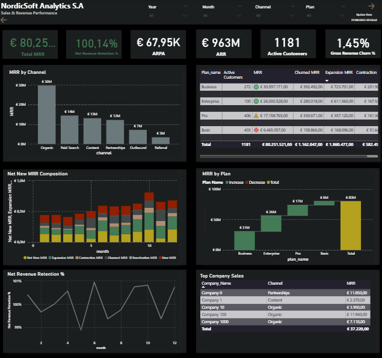
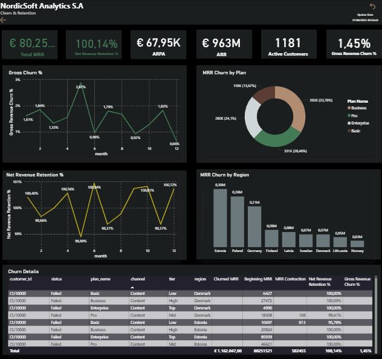

# NordicSoft Analytics – SaaS Business Intelligence Dashboard (Demo)

📊 **Overview**  
This project simulates a SaaS company called **NordicSoft Analytics S.A.**, using synthetic subscription, usage, and billing data.  
The goal is to demonstrate expertise in **Power BI, advanced DAX, and SaaS financial modeling** (MRR, ARR, churn, retention, ARPA).

---

## 🚀 Features
- **Executive Overview**: Strategic SaaS KPIs (MRR, ARR, ARPA, NRR %, Gross Churn %, Active Customers).  
- **Sales & Revenue Performance**: MRR by channel/plan, Net New MRR composition, retention curve, top customers.  
- **Customer Analytics**: Segmentation by region, channel, plan, ARPA vs. MAU, and top customers.  
- **Trials & Conversion**: Funnel conversion from trials to paid accounts, evolution of conversion rate, and trial details.  
- **Churn & Retention**: Gross Churn %, NRR %, churn by plan/region, churn matrix.  
- **Financials & Collections**: Invoicing (Net, VAT, Total), collection rate, and breakdown by region/channel.  

---

## 🛠️ Tech Stack
- **Power BI** (advanced DAX, Power Query, tabular modeling).  
- **SQL / CSV** for demo fact and dimension tables.  
- **Synthetic SaaS metrics modeling** (MRR, churn, ARPA, ARR).  

---

## 📂 Data Structure
- **Fact tables**:  
  - `fact_mrr_monthly` – Monthly recurring revenue.  
  - `fact_mrr_changes` – MRR movements (new, expansion, churn, contraction, reactivation).  
  - `fact_usage_monthly` – Monthly active users (MAU).  
  - `fact_trials` – Trials and conversion funnel.  
  - `fact_invoices` – Billing and collections.  
- **Dimension tables**:  
  - `dim_customer`, `dim_plan`, `dim_channel`, `dim_region`, `dim_date`, `dim_month`.  
- **Measure tables**:  
  - `Measure_CORE`, `Measure_MRR_Movements`, `Measure_Retention_Churn`, `Measure_Invoices`, `Measure_Usage`, `Measure_Time_Intelligence`, `Measure_Waterfall_Helpers`.  

---

## 🔗 Model relationships (keys)
- `fact_mrr_monthly[customer_id]` → `dim_customer[customer_id]`  
- `fact_mrr_monthly[plan_id]` → `dim_plan[plan_id]`  
- `fact_mrr_changes[date_key]` → `dim_date[date_key]`  
- `fact_mrr_changes[customer_id]` → `dim_customer[customer_id]`  
- `fact_usage_monthly[month_key]` → `dim_month[month_key]`  
- `fact_trials[channel_id]` → `dim_channel[channel_id]`  
- `fact_invoices[month_key]` → `dim_date[month_key]`  

---

## 📸 Preview
  
  

---

## 🎯 Key Learnings
- Applied **SaaS KPIs**: MRR, ARR, ARPA, NRR, churn, expansion, reactivation.  
- Built **financial measures** for invoicing, VAT, collection rates.  
- Designed a **dark corporate theme** aligned with SaaS executive reporting.  

---

## 📥 File
- [Download Dashboard PDF](./NordicSoft_Analytics.pdf)

---

## 👨‍💻 Author
**Leonardo Cabral** – Data Analyst | Power BI | SQL | SAP | Power Platform  
Certification in progress: **Microsoft PL-300**
